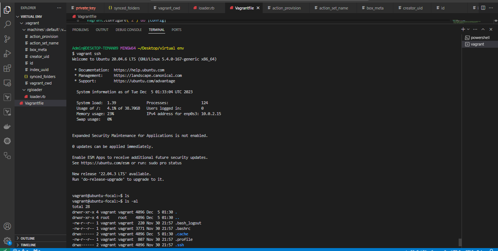

# Setting Up a Virtual Environment on Windows using Oracle VirtualBox and Vagrant

## 1. Introduction

### 1.1 Purpose
This document provides a step-by-step guide to set up a virtual environment on Windows using Oracle VirtualBox and Vagrant. The virtual environment will be provisioned with a Focal Fossa (Ubuntu 20.04 LTS) image.

### 1.2 Scope
This guide is intended for developers and system administrators who want to create a local virtual environment for testing and development purposes.

### 1.3 Audience
- Developers
- System Administrators
- Any individuals interested in creating a virtualized development environment

### 1.4 Document Conventions
- **Bold text:** Indicates actions or commands.
- *Italic text:* Indicates variable names or user-specific input.

## 2. Prerequisites

### 2.1 Hardware Requirements
- A Windows-based machine with sufficient RAM and CPU for virtualization.

### 2.2 Software Requirements
- [Oracle VirtualBox](https://www.virtualbox.org/)
- [Vagrant](https://www.vagrantup.com/)

### 2.3 Familiarity with Virtualization Concepts
Basic understanding of virtualization concepts will be helpful.

## 3. Oracle VirtualBox Installation

### 3.1 Download VirtualBox
Visit the [VirtualBox download page](https://www.virtualbox.org/) and download the latest version for Windows.

### 3.2 Installation Steps
1. **Run** the installer executable.
2. **Follow** the installation wizard instructions.
3. **Complete** the installation.

### 3.3 Configuration Settings
No additional configuration is needed for basic usage.

## 4. Vagrant Installation

### 4.1 Download Vagrant
Visit the [Vagrant download page](https://www.vagrantup.com/) and download the latest version for Windows.

### 4.2 Installation Steps
1. **Run** the installer executable.
2. **Follow** the installation wizard instructions.
3. **Complete** the installation.

### 4.3 Verify Vagrant Installation
Open a command prompt and run:
```bash
vagrant --version
```
Ensure that the version number is displayed, indicating a successful installation.

## 5. Provisioning the Virtual Environment with Vagrant

### 5.1 Create a Project Directory
1. **Create** a new directory for your project.
2. **Navigate** to the project directory in the command prompt.

### 5.2 Initialize Vagrant
Run the following command to initialize Vagrant and create a `Vagrantfile`:
```bash
vagrant box add ubuntu/focal64
```


```bash
vagrant init ubuntu/focal64
```


### 5.3 Configure Vagrantfile
Edit the `Vagrantfile` to customize settings if needed.
```bash
-*- mode: ruby -*-
 vi: set ft=ruby :
Vagrant.configure("2") do |config|
config.vm.box = "ubuntu/focal64"
config.ssh.insert_key = false
config.vm.network "forwarded_port", guest: 80, host: 8080
config.vm.provider "virtualbox" do |vb|
 vb.memory = "1024"
  end
config.vm.provision "shell", inline: <<-SHELL
   apt-get update
  apt-get install -y apache2
   SHELL
end

```
### 5.4 Start the Virtual Environment
Run the following command to start the virtual machine:
```bash
vagrant up
```

 

```bash
vagrant reload
```


### 5.5 Access the Virtual Environment

```bash
vagrant ssh
```



## 6. Conclusion

### 6.1 Summary
This document has provided a guide for setting up a local virtual environment on Windows using Oracle VirtualBox and Vagrant. Developers can now efficiently create, manage, and provision virtualized development environments for testing and development purposes.

### 6.2 Next Steps
Explore additional Vagrant features and customize your virtual environment based on specific project requirements.

---
